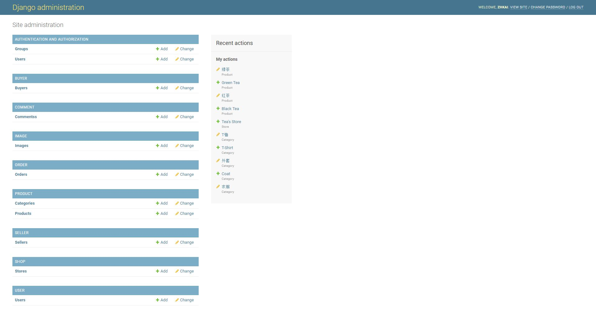
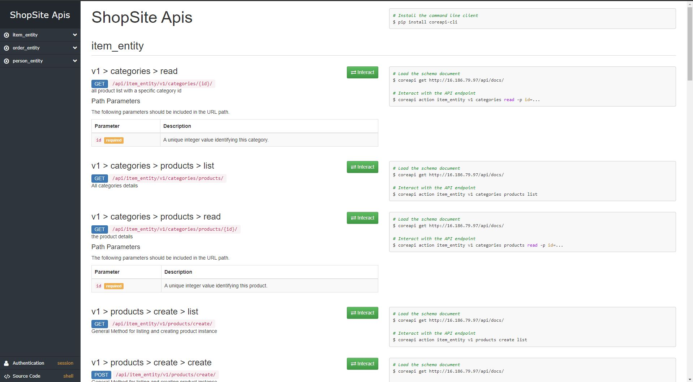
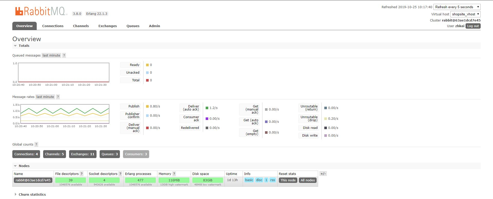
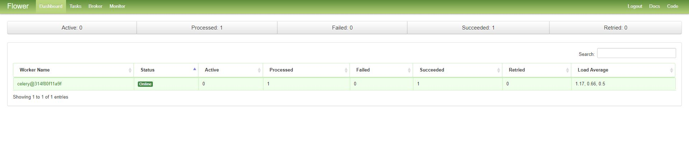
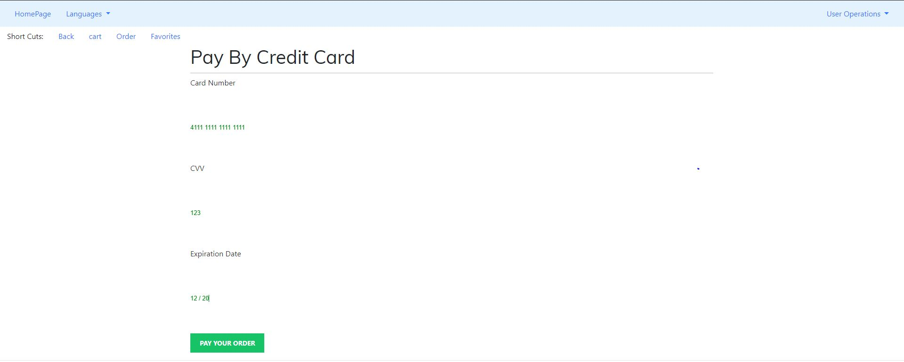

# Online-Shopping
Online Shopping Server

###Application Features ###
>1. Django Origin Backend System Design & Access;
>2. Django Front-End & Back-End Design and Code Implementations;
>3. Django Restful API Implementations and Open;
>4. Django Asynchronous Mail Notifications Function & Brain-Tree Payment Module;
>5. Docker-Compose Packed Package supporting the fast & stable deployment;
### Feature Presentation ###
1. Django Origin Backend System Design & Access;
* The Django Admin Backend System is very promising module among different web frameworks. This web application also enables this powerful tool, and user can access the admin system by redirecting the **/admin** URL with credentials **"zhkai/iso*help"** just like below page.


2. Django Front-End & Back-End Design and Code Implementations;
* This Django Web Framework based ShopSite has the basic functionalities of ShopSite from the User Registrations & Login, Product Review to Order Managements Backends. user can follow the popular shopsite experience to use this application.

3. Django Restful API Implementations and Open;
* In this web application, I not only develop the view/template layer, but also develop the Restful APIs, and then I use the core-api module to generate the API document page where user can test these APIs when accessing the **/api/docs** page.


4. Django Asynchronous Mail Notifications & Brain-Tree Payment Module;
* In this web application, it offers the Asynchronous functions of sending mail when user finishes his registrations or payments. It uses the RabbitMQ as the broker and celery as the task queue dispatcher and flower as the task monitor. User can check the message queue in RabbitMQ page by redirecting its **15672** port and credentials of **"zhkai/iso*help"** and check the task execution result in flower page by redirecting the **5555** port like below two pages:


* This application also embeds the brain-tree module to have a test payment page. Currently it configures a brain-tree sandbox module like below page. And the test credit number is showed in the below example page.

5. Docker-Compose Packed Package supporting the fast & stable deployment;
>  as this web application rely on a lot dependencies packages and use other middleware modules such as PostgreSQL, Redis, RabbitMQ & smtp server. so this application is designed to deploy with the docker-compose. and user can download its docker-compose.yml file to have a stable & faster deployment.
* The Docker-Compose Directory Structure:
```
shopsite
│   docker-compose.yml (main docker-compose file)
│   .env (env file for the docker-compose file)
│   env_mailserver (env file for the especial smtp server)
│   setup.sh (this script is for configuring the credentials for SMTP server)
│
└───shopsite_package
│   │    Dockerfile (Docker File for building the web application)
│   │    run_supervisord.conf (sh file for starting the supervisord application)
│   │    supervisord.conf  (the config file for configuring the superviosrd application)
│   └─── requirements.txt (the requirements file for pip installing the python package)
│
└─── postgresql
│   │    backup
│   └─── data (all data file mounted for the /var/lib/postgres/data path in the container)
│
└─── redis
│   │    conf
│   └─── data
│
└─── rabbitmq
│   │
│   └─── data
│
└─── nginx
│   │    apps (application conf file in the nginx)
│   │    static (all static files for rendering the UI page)
│   │    tmp_log (nginx access log)
│   │    var_log (nginx access log and error log)
│   │    Dockerfile (Dockerfile for building the nginx image)
│   └─── nginx.conf (nginx.conf file for replacing the default nginx.conf file )
│
│
└─── config (this folder is for storing the config file for smtp server)
    │    opendkim
    │    postfix-accounts.cf
    └─── postfix-aliases.cf

```
* this application was built with

### How To Deploy ###
* (Recommended) You better choose to use the docker-compose to run this application, I have built all required image and uploaded them to the Docker hub. When you have your machine has docker & docker-compose installed. It is very simple and quick to startup this application.
1. This is my docker & docker-compose version for a reference.
```
docker version:
Client:
 Version:           18.09.6
 API version:       1.39
 Go version:        go1.10.8
 Git commit:        481bc77156
 Built:             Sat May  4 02:34:58 2019
 OS/Arch:           Linux/amd64
 Experimental:      false

Server: Docker Engine - Community
 Engine:
  Version:          18.09.6
  API version:      1.39 (minimum version 1.12)
  Go version:       go1.10.8
  Git commit:       481bc77
  Built:            Sat May  4 02:02:43 2019
  OS/Arch:          Linux/amd64
  Experimental:     false
docker-compose version:
docker-compose version 1.24.0, build 0aa59064
docker-py version: 3.7.2
CPython version: 3.6.8
OpenSSL version: OpenSSL 1.1.0j  20 Nov 2018
```
2. download the tar file and untar this package.
3. go to this folder and run these below commands to run application or check its logs & status
```
docker-compose up -d -> It will startup this application in the backend.
docker-compose ps -> It will check all container running status, please have all container in "Up" Status.
docker-compose logs -f -> It will see all logs generated when containers are running.
docker-compose logs -f <service-name> -> It will see special logs for a special container, and the service name is in the docker-compose.yml file.
docker-compose down -> It will stop and then remove all container in this environment.
```
4. If all container are running, you can redirect to **8877** port to access this website. and there is a test account **"buyer01/iso*help"** in this database.

5. I have provide the dump file for the PostgreSQL database. and please run the below command to restore these dump data to the database so that you can do the basic functions.
```
docker exec -i $(docker-compose ps -q postgresql) psql -h localhost -U postgres -d shopsite < postgres/backup/shopsite_bak.dmp
```

* (Optional) You can download my source code in your Environment and install all required python package in your environment.
1. download all source code from GitHub:
```
git clone "https://github.com/Godcrying123/Online-Shopping.git"
```
2. please follow below commands to install all required dependencies.
```
pip install pip --upgrade && pip install -r requirements.txt
```
3. Configure the right database, Redis, RabbitMQ & SMTP settings in the  ./shopsite/shopsite/settings/product.py
```
# RabbitMQ Seetings
CELERY_BROKER_URL = 'amqp://<user>:<password>@<RabbitMQ Host>:<RabbitMQ Port>/<VHost>'
```
```
# Redis Settings
CACHES = {
    "default": {
        "BACKEND": "django_redis.cache.RedisCache",
        "LOCATION": "redis://<Redis Host>:<Redis Port>",
        "OPTIONS": {
            "CLIENT_CLASS": "django_redis.client.DefaultClient",
            "CONNECTION_POOL_KWARGS": {"max_connections": 100}
        }
    }
}
```
```
# SMTP Settings
EMAIL_BACKEND = 'django.core.mail.backends.smtp.EmailBackend'
EMAIL_HOST = '<SMTP Server Host>'
EMAIL_HOST_USER = '<Your Account Email and should input to SMTP>'
EMAIL_HOST_PASSWORD = '<Your Account Password should input to SMTP>'
EMAIL_PORT = 25 '<SMTP Server Port, 25 is default value for each SMTP Server>'
```
```
Please uncomment this db settings and then comment all settings for mysql or postgresql if you do not have these type database ready.
# Database Configurations with SQLite3
DATABASES = {
    'default': {
        'ENGINE': 'django.db.backends.sqlite3',
        'NAME': os.path.join(BASE_DIR, 'db.sqlite3'),
    }
}
```
4. Go to the base folder of this project and then run below command to startup applications. you can check the application status by reviewing supervisord.log in /tmp folder.
```
python shopsite/manage.py makemigrations makemigrations user shop seller product order image comment buyer
python shopsite/manage.py migrate
supervisord -c conf/supervisord.conf
```
5. If there is no error for superviosrd,  you can redirect to **8000** or **8001** port to access this website. and there is a test account **"buyer01/iso*help"** in this database.
